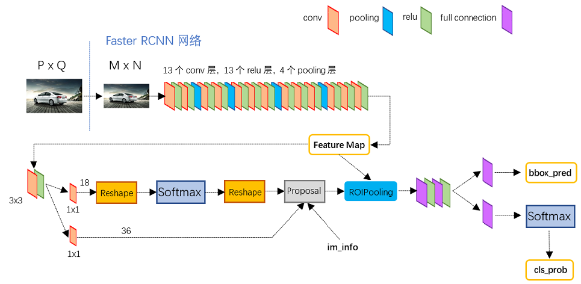
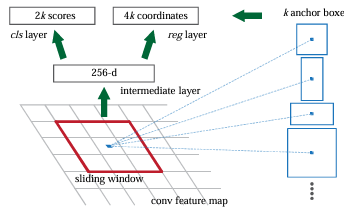

# Faster-RCNN

> Ross B. Girshick在2016年提出了新的Faster RCNN，在结构上，Faster RCNN已经将特征抽取(feature extraction)，proposal提取，bounding box regression(rect refine)，classification都整合在了一个网络中，使得综合性能有较大提高，在检测速度方面尤为明显。

核心：Faster-RCNN = Fast-RCNN + RPN

Faster-RCNN的流程：

+ 将图像压缩到固定尺寸大小（短边一侧为600，另一侧按比例缩放）,输入到特征层的backbone，这里既可以是vgg16，也可以是resnet、mobilenetv3，得到所属的特征图。
+ 将特征图送入RPN层，生成对应的候选框，以及....
+ 将每个特征矩阵通过ROI pooling生成7x7大小的特征图，最后像Fast RCNN一样展平分别输出边框回归参数以及分类预测结果

